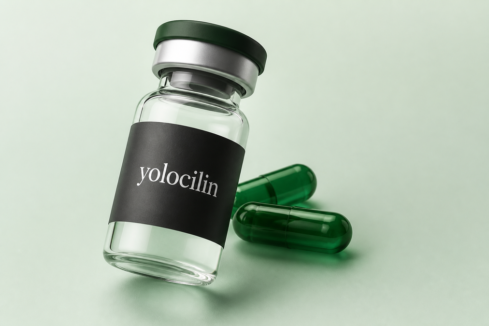
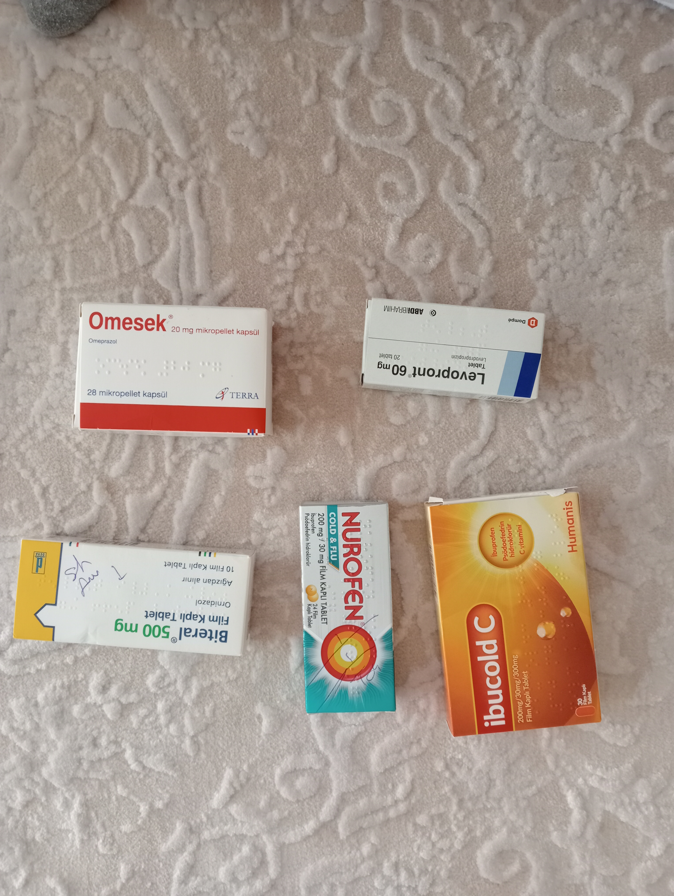

<p align="center">
  
</p>

# Yolocilin

### Medicine Box Detection System

<p align="center">
  <strong>Scan a medicine box · Identify the drug · Get a short explanation</strong>
</p>

<p align="center">
  AI pipeline (YOLOv8 + OCR + fuzzy matching) · FastAPI backend · Flutter Android app<br/>
  Computer Engineering internship project · Git Feature Branch Workflow
</p>

<p align="center">
  <a href="https://github.com/Melikeda/medicine-box-detection-yolov8/actions/workflows/backend-tests.yml"></a>
  <a href="https://github.com/Melikeda/medicine-box-detection-yolov8/actions/workflows/mobile-tests.yml"></a>
  
  
  
</p>

<p align="center">
  
</p>

> **Not medical advice.** Yolocilin helps identify packaging text against a seed catalog. Always confirm with the official leaflet or a pharmacist.

---

## Why this project?

Photographing a box and guessing the brand is brittle. Yolocilin turns that into a clear pipeline:

1. **Detect** the box (YOLOv8)
2. **Read** the print (OpenCV + EasyOCR)
3. **Match** against a curated catalog (RapidFuzz + SQLite, **131** drugs)
4. **Show** results on Android — with optional Gemini explanation and scan history

Built as a modular internship system: learnable `examples/`, production `src/` + `backend/` + `mobile/`.

---

## Features

| Area | What you get |
|------|----------------|
| Detection | Multi-box YOLO with confidence fallback |
| OCR | Fast / accurate modes, early exit on match |
| Catalog | TİTCK-enriched seed CSV → SQLite (**131** rows) |
| API | Analyze, medicines, explain, server scans |
| Mobile (Yolocilin) | Gallery + camera, results, local history, best-effort server sync |
| Ops | Docker, GitHub Actions CI, production CORS/docs hardening |
| Quality | pytest + Flutter tests + API E2E smoke ([Report 25](docs/reports/25-e2e-performance.md)) |

### Sample inputs

| Single box | Multi-box |
|------------|-----------|
|  |  |

---

## How it works

```text
Yolocilin (Flutter)
        │
        ▼
POST /api/v1/analyze  (FastAPI)
        │
        ▼
YOLOv8 → Crop → OpenCV → EasyOCR → RapidFuzz → SQLite (131)
        │
        ├─► local history + POST /api/v1/scans
        ▼
JSON → Result screen
        │
        ▼ (optional)
POST /api/v1/explain → Gemini → “İlaç hakkında”
```

More detail: [docs/architecture.md](docs/architecture.md)

---

## Tech stack

| Layer | Tools |
|-------|-------|
| Detection | YOLOv8n, Ultralytics, PyTorch |
| Vision | OpenCV, EasyOCR |
| Matching | RapidFuzz |
| Data | CSV seed + SQLite (`medicines` + `scans`) |
| Backend | FastAPI, Pydantic, Uvicorn |
| LLM | Google Gemini (optional) |
| Mobile | Flutter / Dart — **Yolocilin** |
| DevOps | pytest, Docker, GitHub Actions |

Rationale: [docs/technology-selection.md](docs/technology-selection.md)

---

## Quick start

```bash
git clone https://github.com/Melikeda/medicine-box-detection-yolov8.git
cd medicine-box-detection-yolov8
python -m venv venv

# Windows
venv\Scripts\Activate.ps1

pip install -r requirements.txt
cp .env.example .env   # optional local overrides
```

**Supported Python:** 3.11+ (CI uses 3.11; Docker image uses 3.12).

### CLI analyze

```bash
python run_analyze.py --image data/samples/parol_plus.jpg --mode fast
```

Trained YOLO weights are **not** in Git. Place `best.pt` at the path expected by config / compose (see [setup guide](docs/setup-guide.md)).

### API

```bash
python run_api.py
```

| Method | Path | Description |
|--------|------|-------------|
| GET | `/health` | Readiness |
| POST | `/api/v1/analyze` | Image → match results (`mode=fast\|accurate`) |
| GET | `/api/v1/medicines` | Search / list catalog |
| POST | `/api/v1/explain` | Short Gemini text (needs key) |
| POST/GET/DELETE | `/api/v1/scans` | Server scan history |

Dev docs: `http://127.0.0.1:8000/docs` (disabled when `ENVIRONMENT=production`).

```bash
curl -X POST "http://127.0.0.1:8000/api/v1/analyze?mode=fast" \
  -F "file=@data/samples/parol_plus.jpg"
```

### Docker

```bash
docker compose up --build
```

### Mobile (Android)

```powershell
. .\scripts\env-flutter.ps1
flutter emulators --launch medicine_box_emulator
.\scripts\push-samples-to-emulator.ps1
cd mobile
flutter run
```

Default API URL on emulator: `http://10.0.2.2:8000`.  
Details: [mobile/README.md](mobile/README.md)

> CPU OCR often takes **1–3 minutes** per photo in fast mode.

---

## Configuration & security

| Topic | Notes |
|-------|--------|
| Env template | [`.env.example`](.env.example) |
| Production | `ENVIRONMENT=production`, explicit `CORS_ORIGINS` (no `*`), `/docs` off |
| Explain | `LLM_ENABLED=true` + valid `GEMINI_API_KEY` (or mock mode) |
| Rate limits | Analyze / explain / scans (per IP) |
| Secrets | Never commit `.env` or API keys |

See [SECURITY.md](SECURITY.md) and [Report 20](docs/reports/20-production-hardening.md).

---

## Project layout

```text
medicine-box-detection-yolov8/
├── backend/app/           # FastAPI (analyze, medicines, explain, scans)
├── src/                   # Pipeline services (YOLO, OCR, matching, DB)
├── mobile/                # Yolocilin Flutter client
├── data/
│   ├── database/          # medicines.csv (+ SQLite at runtime)
│   └── samples/           # Test photos
├── docs/                  # Architecture, roadmap, reports, assets/
├── examples/              # Step-by-step learning scripts
├── tests/                 # pytest (incl. E2E smoke)
├── scripts/               # Dev helpers, e2e_api_flow, benchmarks
├── run_api.py
├── run_analyze.py
├── docker-compose.yml
└── requirements.txt
```

---

## Status: done vs next

### Done

Pipeline, FastAPI, Docker, CI, Flutter MVP, camera, bilingual UI polish, Gemini explain, local + server scan history, production hardening, catalog refresh (131), E2E/perf tooling.

### Still open

| Item | Notes |
|------|--------|
| PostgreSQL migration | Optional scale-up |
| Cloud deploy + HTTPS | Reverse proxy / hosting |
| Per-user auth for scans | Scans are global until auth |
| iOS client | Android-first today |
| Internship final report | Docs polish in progress |
| Dataset publishing / v1.0 release | Later phases |

Roadmap: [docs/roadmap.md](docs/roadmap.md) · Active polish branch: `feature/final-polish-4`

---

## Tests & performance

```bash
pytest                                 # backend
pytest tests/test_e2e_api_flow.py -q   # API E2E smoke
python scripts/e2e_api_flow.py --skip-analyze
python scripts/benchmark_analyze.py --image data/samples/parol_plus.jpg --mode fast
```

```powershell
cd mobile
flutter analyze
flutter test
```

---

## Documentation

| Doc | Description |
|-----|-------------|
| [architecture.md](docs/architecture.md) | System design |
| [setup-guide.md](docs/setup-guide.md) | Full environment setup |
| [roadmap.md](docs/roadmap.md) | Phases & remaining work |
| [technology-selection.md](docs/technology-selection.md) | Why each tool |
| [reports/](docs/reports/) | Phase technical reports (01–25) |
| [SECURITY.md](SECURITY.md) | Security & disclosure |
| [CONTRIBUTING.md](CONTRIBUTING.md) | Branch / PR workflow |
| [CHANGELOG.md](CHANGELOG.md) | Notable changes |

---

## Contributing

1. Branch from `main`: `feature/<short-name>`
2. Keep changes focused; link issues in the PR
3. Run backend + mobile checks before review

See [CONTRIBUTING.md](CONTRIBUTING.md).

---

## License

MIT — see [LICENSE](LICENSE).

---

## Author

**Melike** — Computer Engineering student  
GitHub: [Melikeda](https://github.com/Melikeda)

<p align="center">
  If Yolocilin helped you learn or build something, a star is appreciated.
</p>
